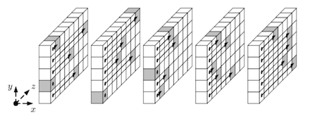

name: inverse
layout: true
class: center, middle, inverse
---
template: inverse
# SHA-3
.footnote[Quenio]
---
layout: false
.left-column[
## Hash Criptográfico
]
.right-column[
- SHA-3: algoritmo de hash criptográfico. 

    - Adotado pelo NIST - Instituto Nacional de Padrões e Tecnologia (EUA)
     
    - Complementa SHA-2, seu antecessor.

        
]
---
layout: false
.left-column[
## Hash Criptográfico
## Algoritmo Keccak
]
.right-column[
- SHA-3: aplicação da função Keccak.

    - Usando parâmetros específicos.

    - Autores: Guido Bertoni, Joan Daemen, Michaël Peeters, Gilles Van Assche
    
    - Vencedores da competição do NIST. 
    
    - Keccak: escolhido como o algoritmo SHA-3

```


KECCAK[c] = SPONGE[KECCAK-p[1600, 24], pad10*1, 1600 – c]
```
]
---
template: inverse
## Estrutura
SHA-3
---
layout: false
.left-column[
### Função Esponja
]
.right-column[
- A estrutura do algoritmo Keccak é definida pela função Esponja.

```

KECCAK[c] = SPONGE[KECCAK-p[1600, 24], pad10*1, 1600 – c]
```


]
---
layout: false
.left-column[
### Função Esponja
]
.right-column[
- A estrutura do algoritmo Keccak é definida pela função Esponja.
 
    - A função Esponja tem duas fases.
    

    
]
---
layout: false
.left-column[
### Função Esponja
]
.right-column[
- A estrutura do algoritmo Keccak é definida pela função Esponja.
 
    - A função Esponja tem duas fases.
     
    - Absorção: onde blocos da mensagem de entrada são "absorvidos" pela função.


    
]
---
layout: false
.left-column[
### Função Esponja
]
.right-column[
- A estrutura do algoritmo Keccak é definida pela função Esponja.
 
    - A função Esponja tem duas fases.
     
    - Absorção: onde blocos da mensagem de entrada M são "absorvidos" pela função.
    
    - Squeezing: onde o valor de _hash_ Z é gerado

    
]
---
layout: false
.left-column[
### Função Esponja
]
.right-column[
- A estrutura do algoritmo Keccak é definida pela função Esponja.
 
    - A função Esponja tem duas fases.
     
    - Absorção: onde blocos da mensagem de entrada M são "absorvidos" pela função.
    
    - Squeezing: onde o valor de _hash_ Z é gerado
    
    - Em ambas fases, ocorrem permutações e subsituições em cada bloco de entrada: f
    

]
---
layout: false
.left-column[
### Função Esponja
### Função Keccak-p
]
.right-column[
- Keccak-p é a função executada pela função Esponja em cada bloco da mensagem de entrada M.


]
---
layout: false
.left-column[
### Função Esponja
### Função Keccak-p
]
.right-column[
- Keccak-p é a função executada pela função Esponja em cada bloco da mensagem de entrada M.
 
    - Para cada bloco, são executadas 24 rodadas das funções de permutação e substituição.
    
        
    
]
---
layout: false
.left-column[
### Função Esponja
### Função Keccak-p
]
.right-column[
- Keccak-p é a função executada pela função Esponja em cada bloco da mensagem de entrada M.
 
    - Para cada bloco, são executadas 24 rodadas das funções de permutação e substituição.
    
    - O estado destas rodadas vai sendo mantido numa estrutura chamada _state array_:
    
        
]
---
layout: false
.left-column[
### Função Esponja
### Função Keccak-p
]
.right-column[
- Keccak-p é a função executada pela função Esponja em cada bloco da mensagem de entrada M.
 
    - Para cada bloco, são executadas 24 rodadas das funções de permutação e substituição.
    
    - O estado destas rodadas vai sendo mantido numa estrutura chamada _state array_:
    
        - Os primeiros r bits são um XOR entre:
         
            - Um bloco da mensagem de entrada 
            
            - E os primeiros r bits do estado da rodada anterior.

                
]
---
layout: false
.left-column[
### Função Esponja
### Função Keccak-p

]
.right-column[
- Keccak-p é a função executada pela função Esponja em cada bloco da mensagem de entrada M.
 
    - Para cada bloco, são executadas 24 rodadas das funções de permutação e substituição.
    
    - O estado destas rodadas vai sendo mantido numa estrutura chamada _state array_:
    
        - Os primeiros r bits são um XOR entre:
         
            - Um bloco da mensagem de entrada 
            
            - E os primeiros r bits do estado da rodada anterior.
        
        - 10*1 padding ocorre no último bloco da mensagem para inteirar r bits.  

        - Os c últimos bits são inicialmente zeros. 
        
            - Mas vão se alterando de acordo com as permutações e substitbuições de cada rodada.
]
---
template: inverse
## Permutações & Substituições
SHA-3
---
layout: false
.left-column[
## Step Mappings
]
.right-column[
- As funções de permutação e substituição (step mappings) são executadas na seguinte sequência:

    
]
---
layout: false
.left-column[
## Step Mappings
## State Array 
]
.right-column[
- Cada função de permutação e substituição vai manipular o State Array como uma matriz.    

    - Uma matriz 5x5 onde cada célula é uma palavra de w bits.
    
    
]
---
layout: false
.left-column[
## Step Mappings
## State Array 
]
.right-column[
- Cada função de permutação e substituição vai manipular o State Array como uma matriz.    

    - Uma matriz 5x5 onde cada célula é uma palavra de w bits.
    
    - Convertida com a seguinte fórmula:
     
        ```
        A[x, y, z] = S[w(5y+x)+z]
        ```
]
---
layout: false
.left-column[
## Theta
]
.right-column[
- Theta é uma função de substituição que utiliza bits das colunas anteriores e posteriores, além dos bits da célula sendo substituída.
 

]
---
layout: false
.left-column[
## Theta
]
.right-column[
- Theta é uma função de substituição que utiliza bits das colunas anteriores e posteriores, além dos bits da célula sendo substituída. 

    - Cada bit substituído depende de outros 11 bits, o que provê uma difusão de alto grau.


]
---
layout: false
.left-column[
## Theta
## Rho
]
.right-column[
- _Rho_ é uma função de permutação dos bits dentro de cada palavra do state array. 

```
    ...
    For t from 0 to 23:
        A′[x, y, z] = A[x, y, (z–(t+1)(t+2)/2) mod w]
    Let (x, y) = (y, (2x+3y) mod 5).
    ...    
```
]
---
layout: false
.left-column[
## Theta
## Rho
]
.right-column[
- _Rho_ é uma função de permutação dos bits dentro de cada palavra.
 
    - O número de _shifts_ varia de acordo com a posição da palavra e seus bits no state array:

    
]
---
layout: false
.left-column[
## Theta
## Rho
]
.right-column[
- _Rho_ é uma função de permutação dos bits dentro de cada célula. 

    - O número de _shifts_ varia de acordo com a posição da palavra e seus bits no state array:

    - Sem esta função, a difusão entre as células, ocorreria de forma muito lenta.
    
        
    
]
---
layout: false
.left-column[
## Theta
## Rho
## Pi
]
.right-column[
- _Pi_ é também uma função de permutação. 

```
    A′[x, y, z]= A[(x + 3y) mod 5, x, z]
```
]
---
layout: false
.left-column[
## Theta
## Rho
## Pi
]
.right-column[
- _Pi_ é também uma função de permutação. 

    - A permutação não se dá nos _bits_ de uma palavra, mas entre as palavras da matriz.

    
]
---
layout: false
.left-column[
## Theta
## Rho
## Pi
## Chi
]
.right-column[
- _Chi_ é uma função de substituição baseada no valor do _bit_ corrente e dos _bits_ em posições correspondentes das duas próximas células.
 
    - Sem esta função, SHA-3 seria completamente linear.    
]
---
layout: false
.left-column[
## Theta
## Rho
## Pi
## Chi
## Iota
]
.right-column[
- _Iota_ é uma função de substituição baseada numa tabela - chamada RC, ou seja, constantes de rodada.
 
    - Usa um valor constante e diferente para cada rodada do SHA-3.
    
    - As constantes são geradas num algoritmo de shift linear.
    
    - Somente a célula (0,0) da _state array_ é transformada por esta função.
]
---
template: inverse
## Funções Hash 
SHA-3
---
layout: false
.left-column[
## SHA3-224 
]
.right-column[
```
SHA3-224(M) = KECCAK[448] (M || 01, 224)
```

|_Hash_|||Capacidade|||Bloco|||_State Array_|
|:-:|-|-|:--:|-|-|:-:|-|-|:-:|
|224|||448|||1152|||1600|
]
---
layout: false
.left-column[
## SHA3-224 
## SHA3-256 
]
.right-column[
```
SHA3-224(M) = KECCAK[448] (M || 01, 224)
SHA3-256(M) = KECCAK[512] (M || 01, 256)
```
|_Hash_|||Capacidade|||Bloco|||_State Array_|
|:-:|-|-|:--:|-|-|:-:|-|-|:-:|
|224|||448|||1152|||1600|
|256|||512|||1088|||1600|
]
---
layout: false
.left-column[
## SHA3-224 
## SHA3-256 
## SHA3-384 
]
.right-column[
```
SHA3-224(M) = KECCAK[448] (M || 01, 224)
SHA3-256(M) = KECCAK[512] (M || 01, 256)
SHA3-384(M) = KECCAK[768] (M || 01, 384)
```

|_Hash_|||Capacidade|||Bloco|||_State Array_|
|:-:|-|-|:--:|-|-|:-:|-|-|:-:|
|224|||448|||1152|||1600|
|256|||512|||1088|||1600|
|384|||768|||832|||1600|
]
---
layout: false
.left-column[
## SHA3-224 
## SHA3-256 
## SHA3-384 
## SHA3-512 
]
.right-column[
```
SHA3-224(M) = KECCAK[448] (M || 01, 224)
SHA3-256(M) = KECCAK[512] (M || 01, 256)
SHA3-384(M) = KECCAK[768] (M || 01, 384)
SHA3-512(M) = KECCAK[1024] (M || 01, 512)
```

|_Hash_|||Capacidade|||Bloco|||_State Array_|
|:-:|-|-|:--:|-|-|:-:|-|-|:-:|
|224|||448|||1152|||1600|
|256|||512|||1088|||1600|
|384|||768|||832|||1600|
|512|||1024|||576|||1600|
]
---
template: inverse
## Funções de Saída Variável 
SHA-3
---
layout: false
.left-column[
## SHAKE128 
]
.right-column[
```
SHAKE128(M, D) = KECCAK[256] (M || 1111, D)
```

|_Hash_|||Capacidade|||Bloco|||_State Array_|
|:-:|-|-|:--:|-|-|:-:|-|-|:-:|
|D|||256|||1344|||1600|
]
---
layout: false
.left-column[
## SHAKE128 
## SHAKE256 
]
.right-column[
```
SHAKE128(M, D) = KECCAK[256] (M || 1111, D)
SHAKE256(M, D) = KECCAK[512] (M || 1111, D)
```

|_Hash_|||Capacidade|||Bloco|||_State Array_|
|:-:|-|-|:--:|-|-|:-:|-|-|:-:|
|D|||256|||1344|||1600|
|D|||512|||1088|||1600|
]
---
layout: false
.left-column[
## SHAKE128 
## SHAKE256 
## RawSHAKE
]
.right-column[
```
SHAKE128(M, D) = KECCAK[256] (M || 1111, D)
SHAKE256(M, D) = KECCAK[512] (M || 1111, D)
```

|_Hash_|||Capacidade|||Bloco|||_State Array_|
|:-:|-|-|:--:|-|-|:-:|-|-|:-:|
|D|||256|||1344|||1600|
|D|||512|||1088|||1600|

```
RawSHAKE128(M, D) = KECCAK[256] (M || 11, D)
RawSHAKE256(M, D) = KECCAK[512] (M || 11, D)
```
]
---
template: inverse
## Benefícios 
SHA-3
---
layout: false
.left-column[
## Aplicações 
]
.right-column[
- Keccak permite a configuração da taxa de vazão (throughput). 

    - Melhorando _performance_ em detrimento da segurança.
    
    - Ou vice-versa. 
]
---
layout: false
.left-column[
## Aplicações 
]
.right-column[
- Keccak permite a configuração da taxa de vazão (throughput). 

    - Melhorando _performance_ em detrimento da segurança.
    
    - Ou vice-versa. 

- Ele também permite um tamanho variável do hash gerado.

    - Abrindo o leque de aplicações além das aplicações usuais de algoritmos de hash.
]
---
layout: false
.left-column[
## Aplicações 
## Segurança 
]
.right-column[
- Comparado ao SHA-2, e a outros algoritmos, Keccak tem uma margem de segurança bem alta.
]
---
layout: false
.left-column[
## Aplicações 
## Segurança 
]
.right-column[
- Comparado ao SHA-2, e a outros algoritmos, Keccak tem uma margem de segurança bem alta.
    
    - Suas funções de permutação o tornam menos vulnerável a ataques do que algoritmos tradicionais de hash, como o SHA-2. 
]
---
layout: false
.left-column[
## Aplicações 
## Segurança 
]
.right-column[
- Comparado ao SHA-2, e a outros algoritmos, Keccak tem uma margem de segurança bem alta.
    
    - Suas funções de permutação o tornam menos vulnerável a ataques do que algoritmos tradicionais de hash, como o SHA-2. 
    
    - Quase 80 por cento das funções que fazem parte do Keccak ainda não foram quebradas, enquanto 40 por cento das funções do SHA-2 já foram.
]
---
layout: false
.left-column[
## Aplicações 
## Segurança 
]
.right-column[
- Comparado ao SHA-2, e a outros algoritmos, Keccak tem uma margem de segurança bem alta.
    
    - Suas funções de permutação o tornam menos vulnerável a ataques do que algoritmos tradicionais de hash, como o SHA-2. 
    
    - Quase 80 por cento das funções que fazem parte do Keccak ainda não foram quebradas, enquanto 40 por cento das funções do SHA-2 já foram.
    
    - Os autores provaram matematicamente que o Keccak é seguro contra pré-imagem, segunda pré-imagem e colisões.
]
---
layout: false
.left-column[
## Aplicações 
## Segurança 
## Performance 
]
.right-column[
 - Implementado em software, a performance do SHA-3 é comparável ao SHA-2.
]
---
layout: false
.left-column[
## Aplicações 
## Segurança 
## Performance 
]
.right-column[
- Implementado em software, a performance do SHA-3 é comparável ao SHA-2.
  
- Sua performance em hardware, em termos de thoughput, é muito superior ao SHA-2.
]
---
layout: false
.left-column[
## Aplicações 
## Segurança 
## Performance 
## Design 
]
.right-column[
- Seu design simples, orientado a bits: 
    
    - Torna sua especificação bem clara.
     
    - Facilita seu entendimento e implementação. 
        
]
---
layout: false
.left-column[
## Aplicações 
## Segurança 
## Performance 
## Design 
]
.right-column[
- Seu design simples, orientado a bits: 
    
    - Torna sua especificação bem clara.
     
    - Facilita seu entendimento e implementação. 
        
- Seu design baseado em permutações, e na função de esponja, também permitirá:
     
    - O surgimento de algoritmos alternativos.
         
    - Ou algoritmos para outras aplicações.
]
---
template: inverse
## Deficiências 
SHA-3
---
layout: false
.left-column[
## Inversível 
]
.right-column[
- Como todos os passos do SHA-3 são inversíveis, sabendo-se os estados intermediários, é possível se chegar ao menos a partes da mensagem original.
]
---
layout: false
.left-column[
## Inversível 
## Software Performance 
]
.right-column[
- Como todos os passos do SHA-3 são inversíveis, sabendo-se os estados intermediários, é possível se chegar ao menos a partes da mensagem original.

- Sua performance é razoável em software, mas existem outros algoritmos, como o BLAKE, quem tem performance muito melhor.
]
---
template: inverse
## Concluindo 
SHA-3
---
layout: false
.left-column[
## Keccak 
]
.right-column[
- O design do SHA-3 é simples e elegante comparado a outros algoritmos de hash. 
]
---
layout: false
.left-column[
## Keccak 
]
.right-column[
- O design do SHA-3 é simples e elegante comparado a outros algoritmos de hash. 

- Também é muito flexível nas opções de seus parâmetros e nas aplicações possíveis.
]
---
layout: false
.left-column[
## Keccak
## Longevidade 
]
.right-column[
- O design do SHA-3 é simples e elegante comparado a outros algoritmos de hash. 

- Também é muito flexível nas opções de seus parâmetros e nas aplicações possíveis.

- O SHA-2 já é utilizado por pelo menos uma década e ainda não foi quebrado.
]
---
layout: false
.left-column[
## Keccak
## Longevidade 
]
.right-column[
- O design do SHA-3 é simples e elegante comparado a outros algoritmos de hash. 

- Também é muito flexível nas opções de seus parâmetros e nas aplicações possíveis.

- O SHA-2 já é utilizado por pelo menos uma década e ainda não foi quebrado.

- A margem de segurança do SHA-3, quando comparado ao SHA-2.
]
---
layout: false
.left-column[
## Keccak
## Longevidade 
]
.right-column[
- O design do SHA-3 é simples e elegante comparado a outros algoritmos de hash. 

- Também é muito flexível nas opções de seus parâmetros e nas aplicações possíveis.

- O SHA-2 já é utilizado por pelo menos uma década e ainda não foi quebrado.

- A margem de segurança do SHA-3, quando comparado ao SHA-2.

- Mesmo com os avanços de hardware e cripto-análise da próxima década, espera-se que o SHA-3 seja seguro nos próximos 10 anos, ou mais.
]
---
layout: false
.left-column[
## Keccak
## Longevidade
## Pesquisa
]
.right-column[
- O design do SHA-3 é simples e elegante comparado a outros algoritmos de hash. 

- Também é muito flexível nas opções de seus parâmetros e nas aplicações possíveis.

- O SHA-2 já é utilizado por pelo menos uma década e ainda não foi quebrado.

- A margem de segurança do SHA-3, quando comparado ao SHA-2.

- Mesmo com os avanços de hardware e cripto-análise da próxima década, espera-se que o SHA-3 seja seguro nos próximos 10 anos, ou mais.

- Será interessante ver o que os trabalhos de pesquisa e cripto-análise irão dizer nos próximos anos.
]
---
template: inverse
## Long live, SHA-3! 
